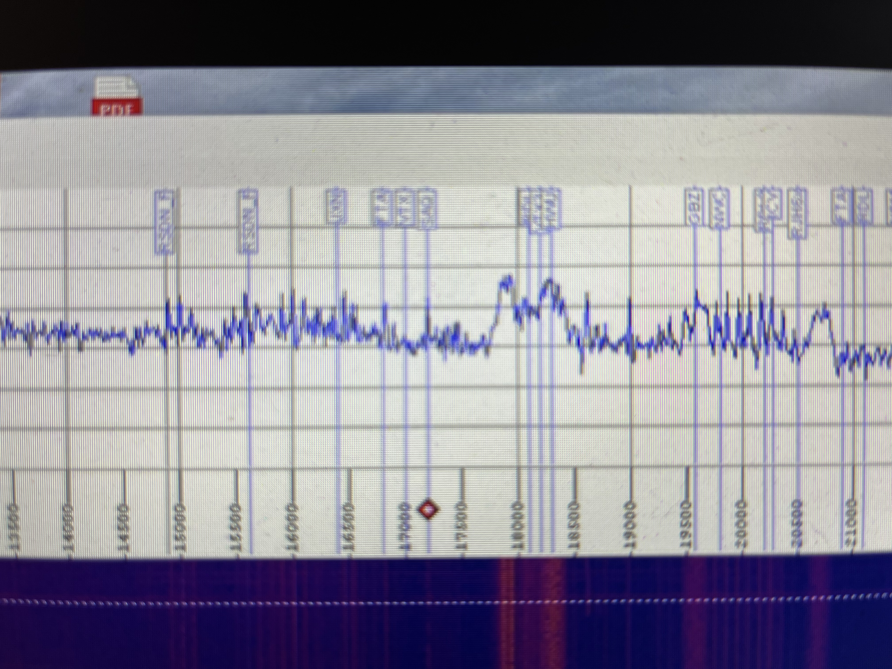

 

# VLF/SAQ Reception

## Introduction

## Antenna

## Preamplifier

## References

[1] SAQ Reception procedure inclduging pre-amp design https://alexander.n.se/en/the-radio-station-saq-grimeton/lyssna-pa-saq/

[2] Magnetic loop antenna

[3] Obtaining coordinates of your location,  https://www.gps-coordinates.net/

[4] Obtaining azimuth map, https://ns6t.net/azimuth/

[3] Installing Spectrum lab software by Wolfgang Buescher, DL4YHF https://www.qsl.net/dl4yhf/spectra1.html

[4] Importing SAQ pre-sets to Spectrum Lab by Wolfgang Buescher, DL4YHF  https://www.qsl.net/dl4yhf/speclab/vlf_rcvr.htm