

 

# Wprowadzenie
Pomysł przeprowadzenia odbioru sygnału emitowanego przez szwedzką stację SAQ nadającą spod Geteborga pojawił się przed ponad rokiem. Gdy pierwsza próba odbioru z wykorzystaniem anteny aktywnej miniwhip zakończyła się niepowodzeniem, postanowiłem spróbować ponwnie, ale tym razem wykorzystując przedwzmacniacz opisany na stronach Stowarzyszenia Przyjaciół Aleksandra Grimetona [1] w połączeniu z anteną magnetyczną.
Wyniki tego eksperymentu oraz wyzwania przed jakimi stanąłem w trakcie jego realizacji opisałem w poniższym artykule.
Źródłem inspiracji do ponownego zmierzenia się z problematyką odbioru sygnałów VLF (Very Low Frequencies) oraz cennych uwag w trakcie przygotowań był kolega Jacek Lipkowski, SQ5BPF. Dziękuję Jacku!

# Antena

## Konstrukcja Anteny

Podczas pierwszej próby odbioru sygnału SAQ posłużyłem się anteną aktywną typu miniwhip podłączoną do odbiornika RSPA1A z oprogramowaniem SDRPlay [3] konstrukcja tej anteny została opisana w [2], w moim przypadku poziom zakłóceń całkowicie uniemożliwił odbiór sygnałów SAQ czy DCF-77 mimo, że na pasmach amatorskich 80m i 40m antena sprawowała się znakomicie. Dodawanie tłumików prądów błądzących czy poprawa jakości uziemienia stacji odbiorczej nie przyniosły znaczącej poprawy. 

Zagłębiając się w tematykę odbioru sygnałów VLF można zauważyć, że optymalnym typem anteny dla tych długości fal jest antena pętlowa, która reaguje na składową magnetyczną fali radiowej. Antena miniwhip, którą wykorzystałem podczas nieudanej próby reaguje z kolei na składową elektryczną i dlatego wykazuje dużą wrażliwość na zakłócenia przemysłowe (którego źrodłem mogą być stacje transformatorowe, zasilacze impulsowe itp.). Ponadto magnetyczna antena pętlowa cechuje się dużą kierunkowością co pomaga w zminimalizowaniu zakłóceń przez właściwą orientację anteny względem źródła nieporzadanej emisji. 

Antenę pętlową zbudowałem na ramie drewnianej w kształcie kwadratu o boku 80cm. Uzwojenie anteny to 80 zwojów drutu o średnicy 0.2mm nawiniętego na plastikowe prowadnice [4] przymocowane do drewnianej ramy (indukcyjność: 2.45mH, rezystancja: 68 omów). Antena nie posiada kondensatora strojeniowego, ponieważ obwód rezonansowy zestrojony na częstotliwość SAQ jest częścią układu przedwzmacniacza. Wymiary anteny są znacząco mniejsze od długości fal z zakresu VLF i dlatego nie są krytyczne. Wybór długości boku został podyktowany głównie walorami praktycznymi takimi jak swoboda przemieszczania anteny pomiędzy różnymi lokalizacjami.

Warto też wspomnieć, że wybór pomiędzy anteną pętlową a aktywną anteną miniwhip w dużej mierze zależy od warunków panujących w danej lokalizacji. W przypadku obszarów miejskich o potencjalnie dużym poziomie zakłóceń przemysłowych bardziej optymalnym wyborem wydaje się być antena pętlowa. W warunkach wiejskich antena miniwhip ze względu na wysoką czułość oraz niski poziom zakłóceń występujących w takim środowisku wydaje się znakomitym wyborem.

W praktyce odbiór sygnału SAQ w obszarze miejskim przy wykorzystaniu anteny miniwhip jest jaknajbardziej możliwy, oczywiście przy założeniu niskiego poziomu zakłóceń przemysłowych wstępujących w danej lokalizacji (przypadek Jacka SP5PBE).

## Orientacja Anteny względem radiostacji SAQ

Orientacja anteny nie wymaga specjalistycznego sprzętu i może zostać wykonana zgróbnie przy użyciu aplikacji kompasa dostępnej w telefonach komórkowych (pamiętaj o odznaczeniu opcji "true north" jeśli taka opcja występuje w Twojej aplikacji). W moim przypadku użyłem GPS Compass dostępnej dla systemu iOS. Koordynaty mojej lokalizacji odnalazłem na stronie [4], 

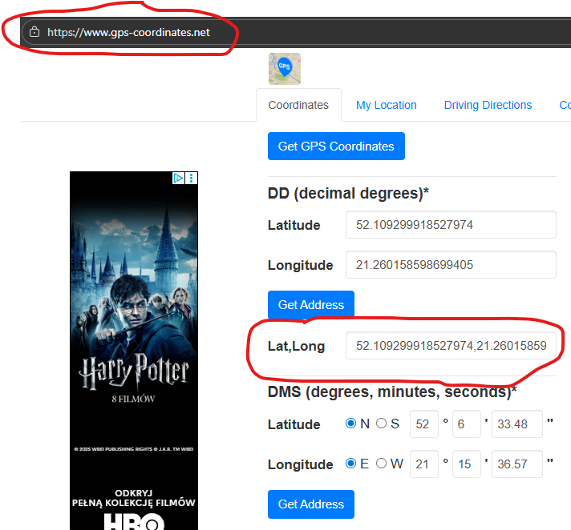

zaś azymut na który musiałem skierować antenę odczytałem z mapy, którą można wygenerować pod adresem [5].

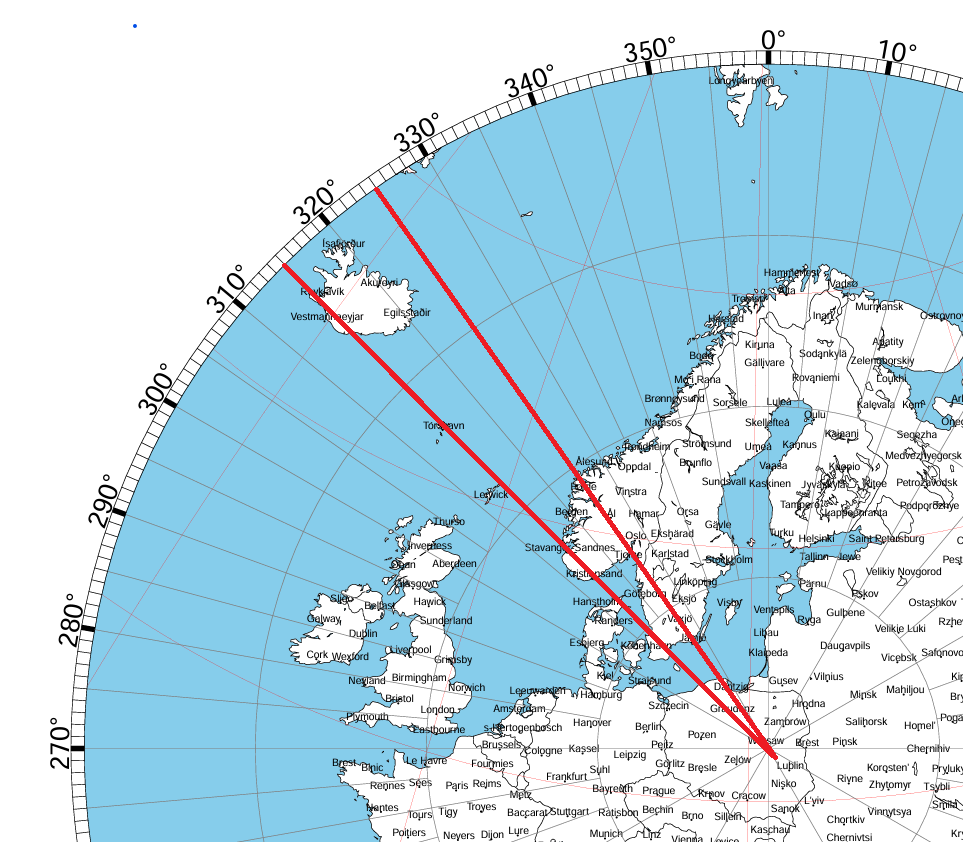

W sytuacji gdy w naszej lokalizacji wystęuje silne źródło zakłóceń kierunkowych warto rozważyć takie ustawienie, które skótkuje najwyższym współczynikiem sygnału do szumu co nie zawsze będzie tożsame z najwyższym poziomem odbieranego sygnału porządanego.

# Przedwzmacniacz

## Budowa przedwzmacniacza

Konstrukcja przedwzmacniacza została opisana na stronach Stowarzyszenia Przyjaciół Aleksandra Grimetona [1]. W ramach tego projektu wprowadziłem następujące modyfikacje:

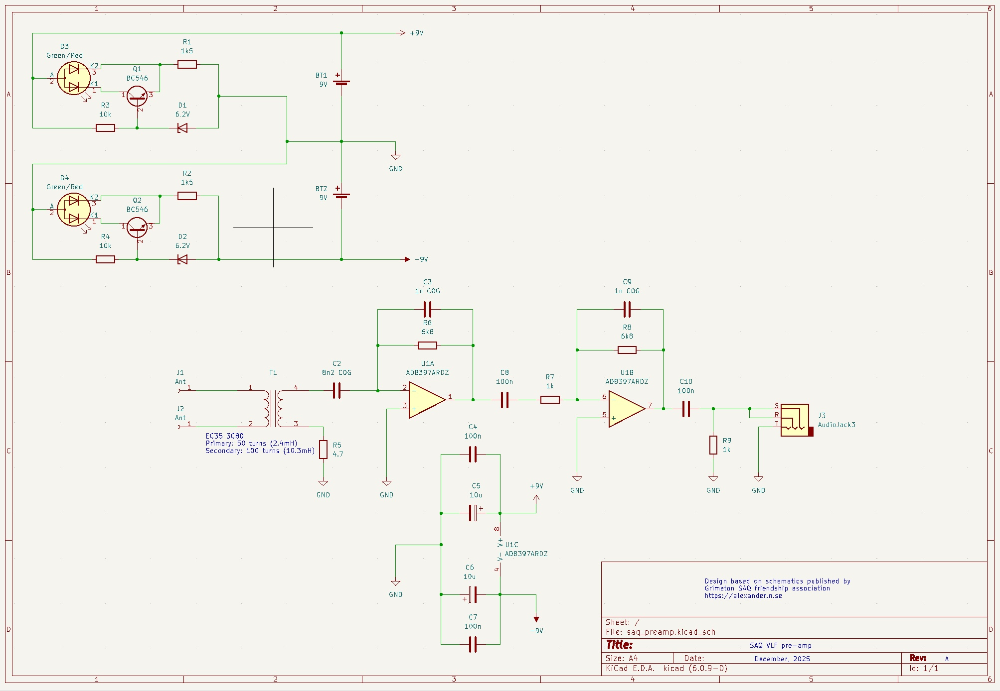

1) Kondensatory odsprzęgające 1uF zostały zastąpione parami kondensatorów 100n oraz 10u
2) Uzwojenie wtórne transformatora wejściowego T1 zwiększono z 90 do 100 zwojów drutu o średnicy 0.2mm
3) Dodano wyjście sma-c w celu łatwiejszego przyłącznia odbiornika SDR takiego jak np. RSP1A [3], w przypadku współpracy przedwzmacniacza z odbiornikiem SDR nie jest wymagany dodatkowy tłumik sygnału, Funkcję tę realizuje filtr górnoprzepustowy utworzony przez elementy C10 (100 nF) oraz rezystor R9 (1 kΩ), pracujący z równoległym obciążeniem w postaci impedancji wejściowej odbiornika SDR (50 Ω). Po dołączeniu odbiornika SDR, charakteryzującego się znacznie niższą impedancją wejściową niż wejście liniowe karty dźwiękowej komputera PC, częstotliwość graniczna filtru ulega przesunięciu w kierunku niższych częstotliwości, co skutkuje efektywnym obniżeniem poziomu sygnału doprowadzanego do obciążenia o około 10 dB.
4) Baterie 4V zastąpiono bardziej dostępnymi bateriami 9V.
5) Dodano proste układy monitorujące stan baterii oparte o tranzystor BC546 oraz diody zabezpieczające przed niewłaściwą polaryzacją. W przypadku obniżenia napięcia zasilania poniżej 8,11V kolor diod LED D3/D4 zmienia się z zielonego na czerwony.

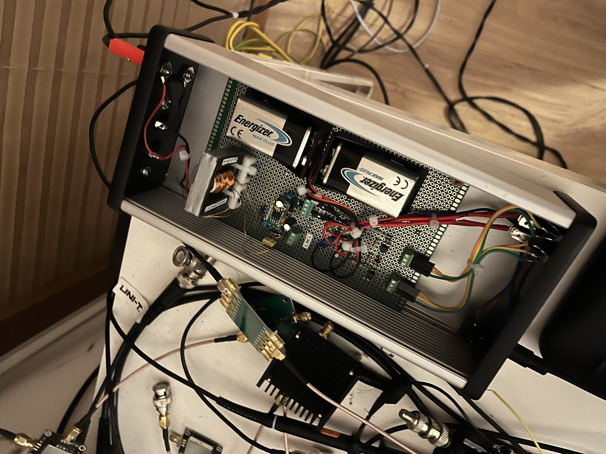

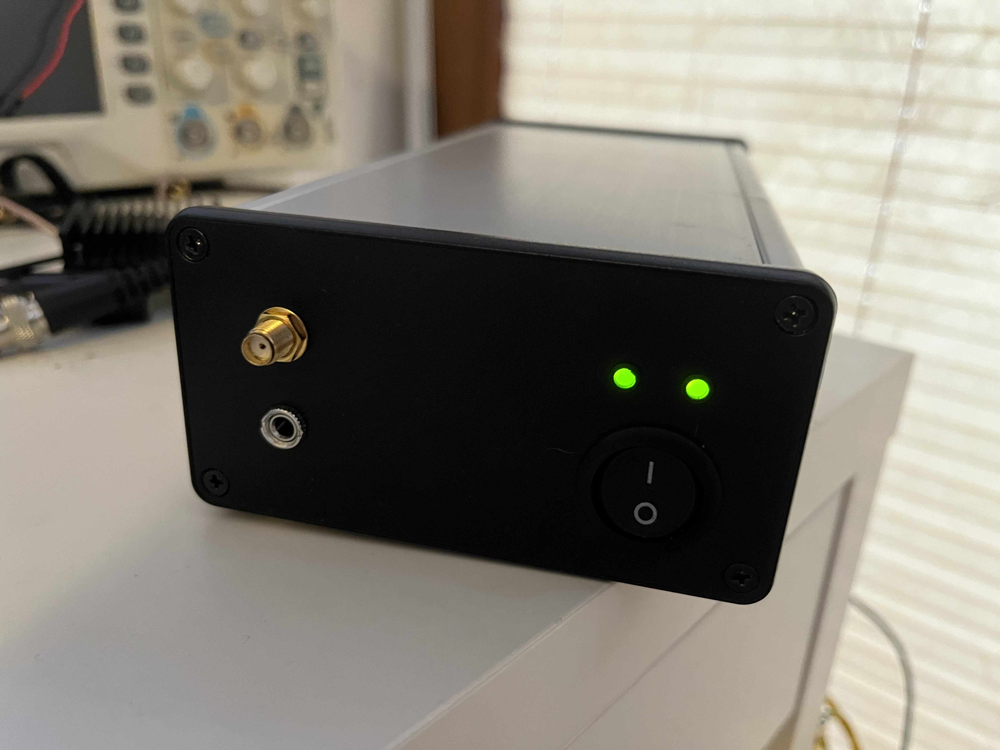
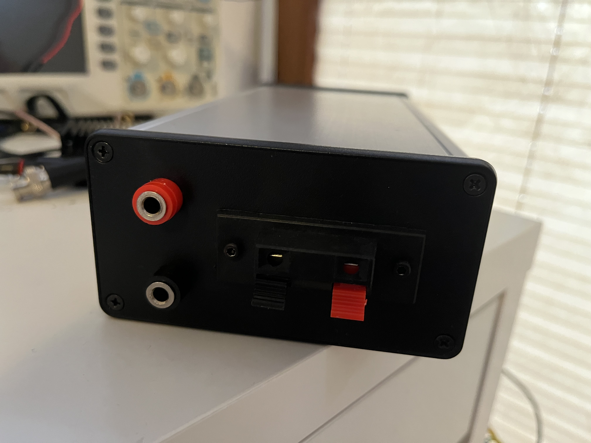

Jak można zauważyć w oparciu o powyższe ilustracje, wzmacniacz nie wprowadza tłumienia, poza pasmem przenoszwenia obwodu rezonansowego, co można z powodzeniem wykorzystać do odbioru stacji innych niż SAQ nadających na częstatliwościach nawet fal długich. Prezentowany układ pozwalił np. na stabilny odbiór sygnałów synchronizacji czasu NPL (60khz) oraz DCF-77 (77.5kHz). W tej samej lokalizacji odbiór tych sygnałów był bardzo niestabilny, a często nawet niemożliwy przy użyciu anteny typu "random wire" (w tym konkretnym przypadku długość elementu odbiorczego wynosiła ok. 13m) czy miniwhip.

## Strojenie przedwzmacniacza

Do zestrojenia wzmacniacza na częstotliwość SAQ 17,2 kHz nie jest wymagane użycie specjalistycznej aparatury pomiarowej. Oczywiście możliwe jest wykorzystanie generatora funkcyjnego oraz oscyloskopu, jednak wystarczającą dokładność zapewnia obserwacja poziomu wzmocnienia szumów tła pochodzących z wejścia przedwzmacniacza pozostawionego bez podłączonej anteny. Jeżeli maksimum poziomu szumów występuje w pobliżu częstotliwości SAQ, można uznać, że układ został prawidłowo zestrojony. Należy przy tym uwzględnić, że obwód rezonansowy charakteryzuje się stosunkowo wąskim pasmem przenoszenia — w przedstawionej implementacji wynoszącym około 200 Hz — co wymaga dość precyzyjnego dostrojenia układu.

W przypadku strojenia przy użyciu generatora funkcjonalnego należy pamiętać o właściwym odseparowaniu generatora od układu przedwzmacniacza, aby w trakcie strojenia częstotliwość rezonansu nie uległa zmianie. Dobrym rozwiązaniem jest użycie krótkiej anteny podłączonej do wyjścia generatora (dwa nie połączone ze sobą kable o długości ok. 10-15cm) znajdującego się w pobliżu przedwzmacniacza lub przyłączenie generatora do układu przedwzmacniacza przez rezystor o dużej oporności np. 100komów. 

### Preamplifier performance

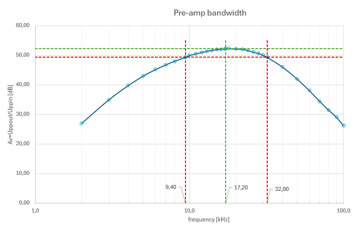

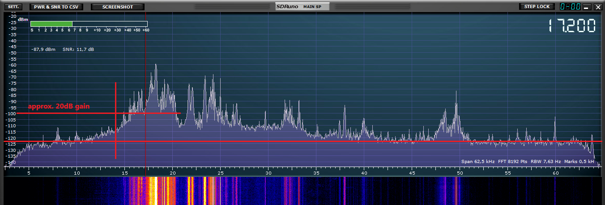

## Potencjalne problemy do uniknięcia

1) Brak kondensatorów odsprzęgających może skutkować wzbudzaniem się układu wzmacniaczy operacyjnych co w skrajnym przywadku może doprowadzić nawet do ich uszkodzenia w skótek przegrzania się. Efekt może występować poza zakresem częstotliwości VLF i nie być bezpośrednio widocznym na osyloskopie czy wodospadzie odbiornika SDR ustawionego na monitorowanie częstotliwości VLF.

2) Strojenie za pomocą generatora funkcyjnego bezpośrednio przyłączonego do układu wejściowego przedwzmacniacza  prowadzi do zmiany charakterystyki obwodu i w efekcie przesunięcia częstotliwości rezonansu w porównaniu do sytuacji, w której obciążeniem uzwojenia pierwotnego jest antena. Jest to podyktowane faktem, że impedancja uzwojenia pierwotnego z szeregowo przyłączoną niską impedancją generatora sygnałowego (o charakterze mocno rezystancyjnym) istotnie wpływa na reaktancję obwodu rezansowego, podwyższając jego częstotliwość rezonansową. 
 
Początkowo nie byłem swiadomy tego zjawiska i aby przy podłączonym generatorze uzyskać szczyt wzmocnienia przypadający na częstotliwość 17.2kHz dodałem do kondenatora C2 (8n2) równolegle kondensator o wartości 22nF. Niestety tak jak to ukazuje poniższa symulacja oraz wyniki pomiarów, po zastąpieniu generatora anteną , częstotliwość rezonansowa obwodu ulegała obniżeniu...

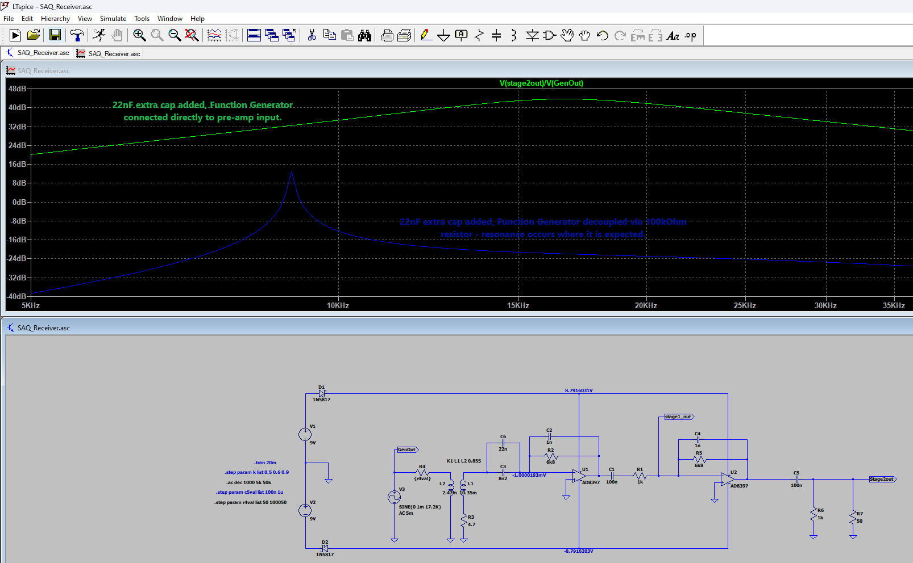

Usunięcie dodatkowego kondensatora 22nF, pozwoliło na uzyskanie poprawnego zestrojenia układu na częstotliwość 17.2kHz z przyłączoną anteną.

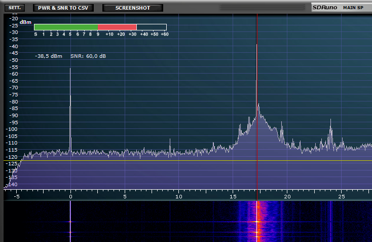

Należy dodać, że podczas testów sygnał SAQ był symulowany przez nośną z generatora sygnałowego do którego wyjścia przyłączony został przewód pełniący rolę prostej anteny. Poziom sygnału wyjściowego generatora w tym scenariouszu testowym był ustawiony na maksymalną wartość.

# Oprogramowanie

Układ przedwzmacniacza może współpracować zarówno z kartą dźwiękową PC jak też odbiornikiem SDR zdolnym do odbioru sygnałów w zakresie VLF (np. moduł RSP1A firmy SDRPlay). 
W przypadku odbioru z wykorzystaniem karty dźwiękowej bardzo dobrze sprawdziło się oprogramowanie SAQrx dostępne na stronie Stowarzyszenia Przyjaciół Aleksandra Grimetona [1], lub oprgramwanie spectrumlab autorstwa Wolfganga Bueschera, DL4YHF. Zaletą pakietu spectrumlab jest dostępność funkcji wodospadu.

W przypadku odbioru z wykorzystaniem układu SDR wybór oprogramowania jest bardzo zależny od wykorzystywanej platformy sprzętowej. W przypadku SDRUno RSP1A, najepszym wyborem wydaje się oprogramowanie rozwijane przez dostawcę sprzętu czyli program SDRPlay.

# Podsumowanie

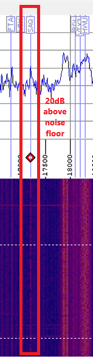

# Źródła

[1] Stowarzyszenie Przyjaciół Aleksandra Grimetona, https://alexander.n.se/
[2] Antena miniwhip, github.com/sp5gw
[3] SDR Play, https://www.sdrplay.com/